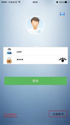
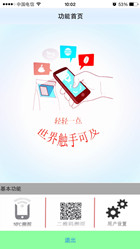
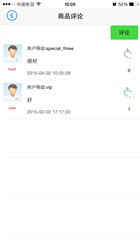
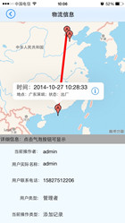

# 产品二维码溯源
该项目主要实现简单的产品溯源，是本人的从事iOS开发以来正式写的第一个应用，由于经验有限，所以难免有些不足。仅供交流学习之用；   

#### 项目介绍   
该应用的主要功能是通过扫描产品包装上的二维码，获取该产品的物流、加工及来源地信息。服务器采用java语言编写，初版与服务器采用socket通信方式。   

#### 开发环境   

xcode5及iOS7；   

#### 开发总结  
通过这次开发，主要还是熟悉了一下三个框架的使用，并了解了socket通信的过程   
1、cocoaAsyncSocket等第三方框架的使用；   
2、MapKit框架的使用；   
3、UIKit各控件的使用；

#### 部分界面   

> 
>    
> 
>    
> 
> 
